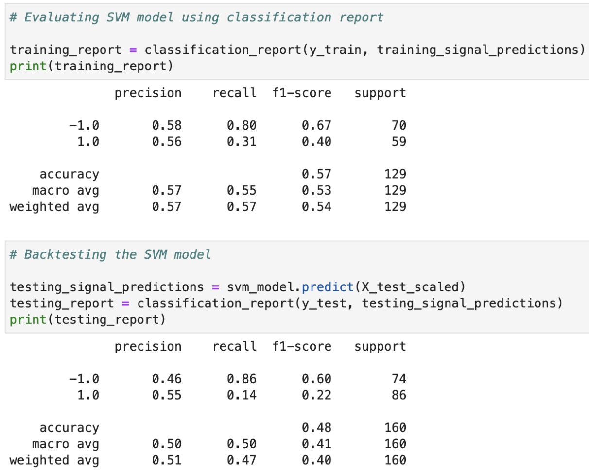

# Money Machine

This repo contains the results of the Money Machine group project. 
 

Equity market has been always portrayed as a glamorous money-making career. However, complex and precise decisions are integral part of making choices and split decisions that result in great rewards.

There are numerous ways means to make buy and sell decisions or evaluations. From making fundamentals analysis into the financials of a company, coverages on Bloomberg, to tweets made by important internet personalities. All these information can and are some mean to get an correct estimate of the how the market is going to trend.
With Money Machine, we aim to use the historical data on the prices and trends, and use machine learning methods to get insight into the intrecate datas, which further will assist the user to make investment decisions.

The application is interactive and allows user to explore different sectors of S&P 500 and see their financial performance over the years. Moreover, the application also ranks the stocks in the sector based on their current risk to return parity. All these features enlightens the user over the best investment prospects.
The application is designed to use SVM(Service Vector Machine) and LSTM (Long Short-Term Machine) to take a deep dive into the publically available price trends to make predictions into the future.

---

## Installation Guide

First, install the following libraries and functions into our development environment:
1. hvplot
2. Matplotlib
3. Keras
4. yfinance
5. Plotly
6. seaborn
7. panda_datareaders
8. Tensorflow

Before running the program make sure to install the following dependencies:

    python
    pip install pathlib
    conda install -c conda-forge scikit-learn
    conda install -c pyviz hvplot
    !pip install yfinance
    !pip install python-dotenv
    !pip install pandas_datareader
    !pip install keras
    !pip install tensorflow

---

## Technologies

This project leverages python 3.7 with the following libraries and dependencies:

* [pandas](https://github.com/pandas-dev/pandas) - For manipulating data

* [hvplot](https://github.com/holoviz/hvplot) - High-level plotting API for the PyData ecosystem built on HoloViews

* [sci-kit learn](https://github.com/scikit-learn/scikit-learn) - Python machine learning library. Used for support vector machine (SVM) model

* [tensor flow](https://github.com/tensorflow/tensorflow) - Open-source software library for machine learning and deep neural networks

* [keras](https://github.com/keras-team/keras) - Open-source software library that provides a Python interface for artificial neural network. Used for long short-term memory (LSTM) model

* [google colab](https://github.com/googlecolab/colabtools) - Notebooks that allow us to combine executable code and rich text in a single document

---

### **Money Machine Analysis**

### **Flow Chart**

### **Sector Analysis and Stock Selection**

1. The first function of the program is to call market data from y finance
2. Next the user will select a market sector to focus their analysis on
3. The program will return a list of all securities in the chosen sector
4. Next the program will calculate the Sharpe and Sortino ratios of the stocks in that sector in order to assist the user in selecting the asset with the best risk/return ratio
5. Finally, once the stock has been selected, the user will set a desired timeframe and the program will pull in the necessary data for the subsequent analysis

### **Using SVM model for Predictions**
1. The first ML model that the program will run is the Support Vector Model (SVM)
2. The data will be split into test and train sets and the user will be asked to select number of epoch/batch size
3. The model will then be trained to the training dataset and then tested against the test set
4. The program will return the calculation report and a graph of the predictions vs. the actual data

The precision is around the same for the 1/-1 classes (buy/sell signals). Recall is 0.80 - 0.86 for predicting -1 class for both the training and testing set. The model is better at predicting when to sell.

The SVM model made trading decisions that underperformed the actual returns.

### **Using LSTM model for Predictions**
1. The second ML model is the Long-Short Term Model (LSTM)
2. Once again the model will be fitted to the train data and tested against the test data
3. The program will return the calculation report and a plot of the predictions overlaid with the actual
4. The user can then select the model which best meets their criteria

### **Streamlit**
The program also incorporates a web-based UI via Streamlit
All functions of the program may be run on this webpage for a no code alternative

### **Analysis**
In our analysis, we found LSTM to be the superior model for stock trend predictions. This was anticipated as it is a RNN and better equipped for these purposes. With some feature engineering, we were able to mitigate issues with over and undercutting the model and reliably predict PGR pricing trends over the selected timeframe. We are confident that, given additional time and resources, this program could be deployed successfully to assist users in implementing an algorithmic trading strategy.

---
## Contributors

Brought to you by Babin Shrestha, David Paquiot, Matthew Field, Feier Ou, and Winnie Mei 

---
## License

MIT
